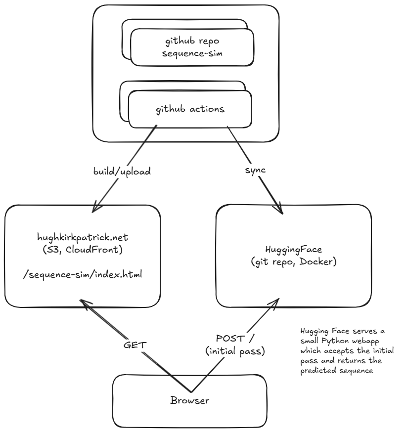

# Football Passing Sequence Simulator

This is a football passing sequence simulator built with a React frontend and a Python FastAPI backend running in Hugging Face 🤗.

The app shows a football pitch and lets you create an initial pass using the mouse. The backend then simulates a likely sequence of passes from the initial pass.

## Model Training

The training dataset is created based on a feature of the SofaScore website. Sofascore allows you to watch the passing sequence leading up to goals, and so every goal that is scored contains data from the passes leading up to it. Using this I created three separate models:

- A model which predicts the player's next move given their position (pass, dribble, shot)
- A model which predicts where the player will pass it to given their position
- A model which predicts where the player will dribble to given their position

The program then uses these models to repeatedly predict the next move and the next position of the ball until the next move is a shot. The resulting passing sequence is then returned and displayed on the webpage.
## Deployment (CI)

The project is deployed using GitHub Actions. The frontend is built and deployed to AWS S3 and the backend is automatically synced with the [Hugging Face space](https://huggingface.co/spaces/Singular-Bean/sequence-sim).

## Building and Running the App

- [Frontend README](./site/README.md)
- [Backend README](./backend/README.md)